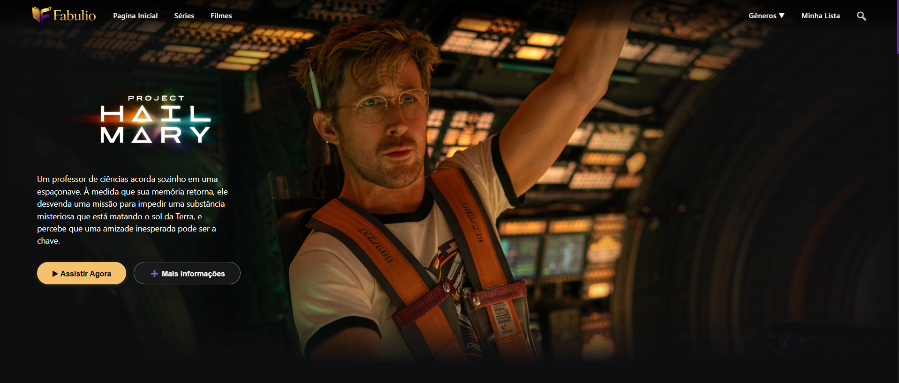
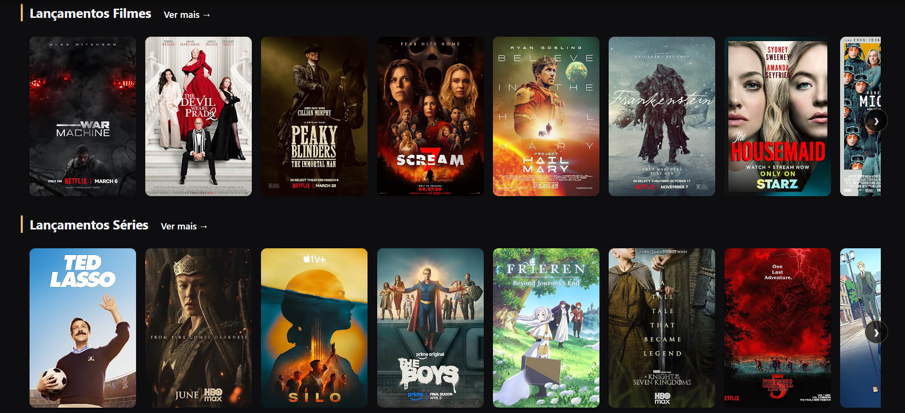

<p align="center">
  
</p>

<p align="center">
  Uma plataforma de streaming inspirada nos maiores serviços do mercado, desenvolvida com foco em uma interface moderna, responsiva e integrada a uma API REST em Java Spring Boot.
</p>

<p align="center">
  
  
  
  
  
</p>

<p align="center">
  <a href="https://gabrielpree.github.io/fabulioFrontEnd">
    
  </a>

  <a href="https://github.com/GabrielPree/fabulio">
    
  </a>
</p>

---

# Sobre o Projeto

O **Fabulio** é uma plataforma de streaming desenvolvida como projeto de portfólio, inspirada em serviços como Netflix, Prime Video e Disney+.

O objetivo do projeto foi desenvolver uma aplicação completa utilizando arquitetura cliente-servidor, consumindo uma API REST desenvolvida em **Java Spring Boot**, com persistência de dados em **PostgreSQL**.

O frontend foi desenvolvido utilizando apenas **HTML, CSS e JavaScript**, sem frameworks, buscando criar uma interface moderna, intuitiva e responsiva.

---

# Preview

<p align="center">
    
</p>

<p align="center">
    
</p>

---

# Funcionalidades

- Catálogo de séries e filmes
- Visualização de temporadas
- Lista completa de episódios
- Pesquisa dinâmica
- Interface inspirada em plataformas de streaming
- Layout responsivo
- Consumo de API REST
- Carregamento dinâmico de conteúdo
- Lista de favoritos

---

# Tecnologias Utilizadas

## Frontend

- HTML5
- CSS3
- JavaScript (ES6+)
- Fetch API

## Backend

- Java 25
- Spring Boot
- Spring Data JPA
- Maven

## Banco de Dados

- PostgreSQL

---

# Arquitetura da Aplicação

```text
                   👤 Usuário
                       │
                       ▼
        Frontend (HTML • CSS • JavaScript)
                       │
               Requisições HTTP
                       │
                       ▼
           API REST (Spring Boot)
                       │
               Spring Data JPA
                       │
                       ▼
                  PostgreSQL
```

---

# Estrutura do Projeto

```text
frontend/

│
├── css/
│
├── js/
│
├── img/
│
├── index.html
│
└── README.md
```

---

# Como Executar o Projeto

## 1 - Clone o repositório

```bash
git clone https://github.com/GabrielPree/fabulio-frontend.git
```

## 2 - Abra a pasta

Utilize o **Visual Studio Code** ou outro editor.

## 3 - Configure a URL da API

No JavaScript altere:

```javascript
const API_URL = "http://localhost:8080";
```

para a URL correspondente da API.

## 4 - Execute

Abra utilizando:

- Live Server
- http-server
- outro servidor local

---

# Projeto Online

**Frontend**

https://gabrielpree.github.io/fabulio-frontend/

---

#  Backend

Repositório:

https://github.com/GabrielPree/fabulio

API :

```
https://fabulio.onrender.com
```

---

# Compatibilidade

| Plataforma | Suporte |
|------------|:-------:|
| Desktop | ✔ |
| Smartphone | ✔ |
| Tablet | ✔ |

---

# Objetivos do Projeto

Este projeto foi desenvolvido para colocar em prática conhecimentos em:

- Desenvolvimento Frontend
- Desenvolvimento Backend
- Consumo de APIs REST
- Arquitetura Cliente-Servidor
- Java Spring Boot
- PostgreSQL
- HTML5
- CSS3
- JavaScript
- Organização de Projetos
- Versionamento com Git e GitHub

---

# Destaques

✔ Interface moderna

✔ Layout inspirado em plataformas de streaming

✔ Consumo de API REST

✔ Integração completa com Spring Boot

✔ Banco de dados PostgreSQL

✔ Projeto Full Stack

✔ Código organizado

✔ Responsivo

---

# Autor

**Gabriel Preé**

Estudante de Análise e Desenvolvimento de Sistemas

Desenvolvedor Full Stack em formação

GitHub:

https://github.com/GabrielPree

---

# Gostou do projeto?

Se este projeto foi útil ou interessante para você, considere deixar uma ⭐ no repositório.

Isso ajuda bastante na divulgação do projeto.

---

# Licença

Este projeto está distribuído sob a licença **MIT**.
